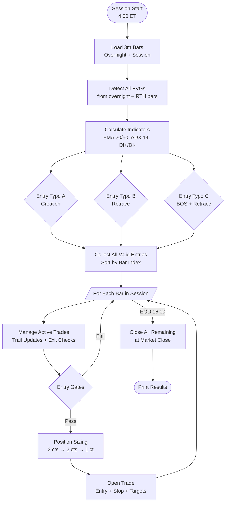
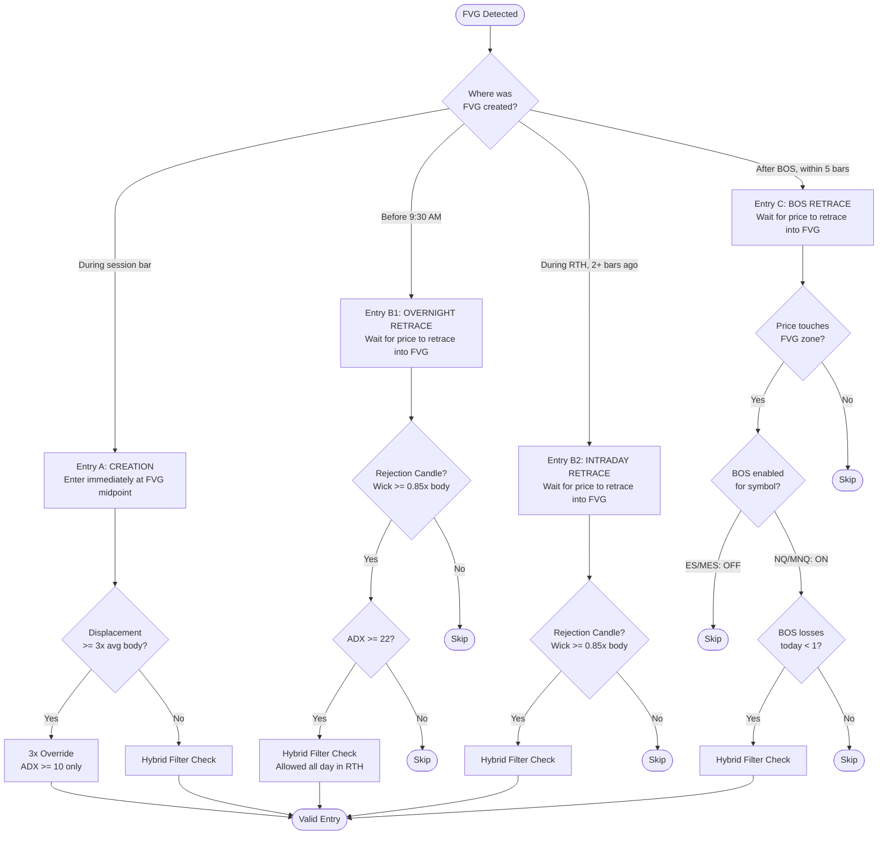
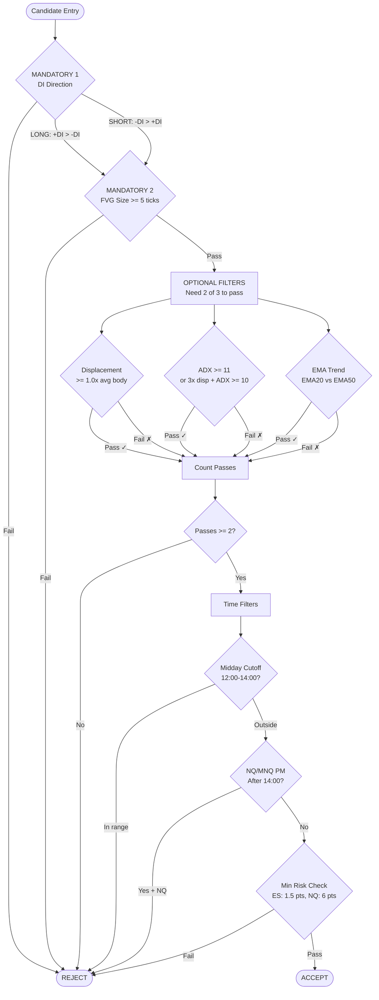
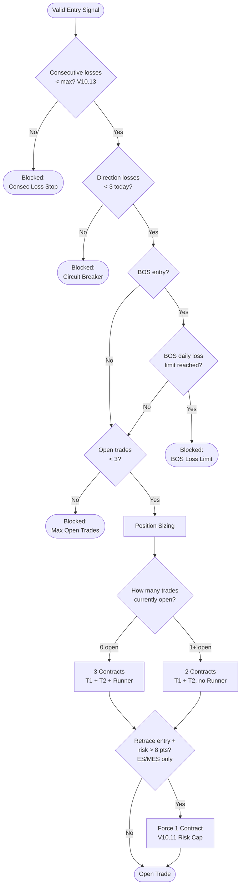
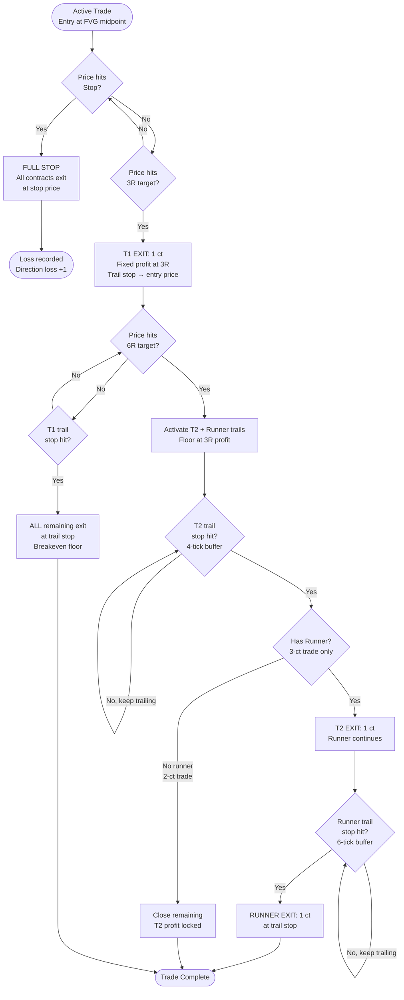
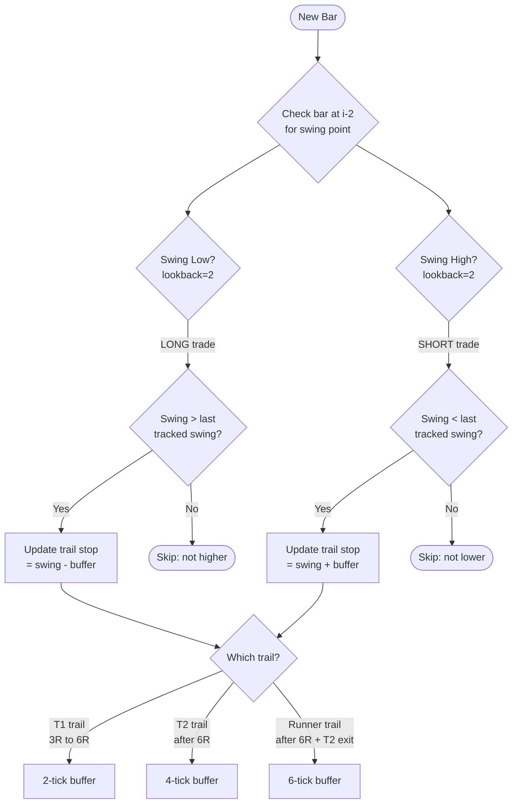
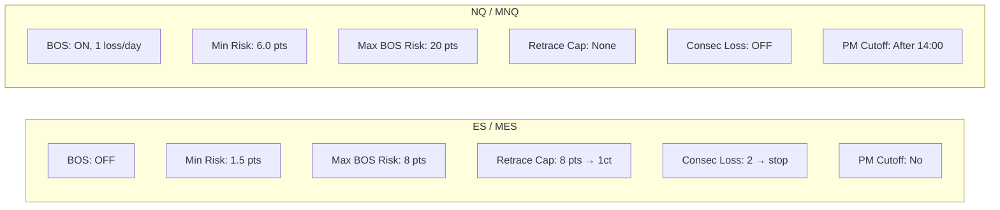
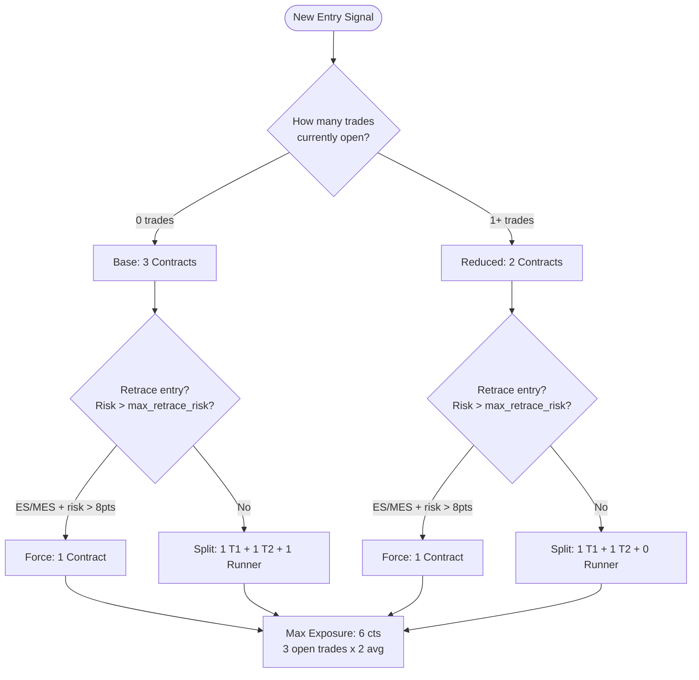

# V10.13 ICT FVG Strategy — Flow Diagrams

## 1. Master Strategy Flow

## 2. Entry Type Decision Tree

## 3. Hybrid Filter Pipeline (V10.8)

## 4. Entry Gate Checks

## 5. Exit / Trade Management Flow

## 6. Structure Trail Update Logic

## 7. Per-Symbol Configuration

## 8. Session Timeline

```mermaid
gantt
    title Trading Session Timeline (EST)
    dateFormat HH:mm
    axisFormat %H:%M

    section Pre-Market
    Overnight FVG Tracking     :04:00, 05:30

    section Pre-RTH
    All Entry Types Active     :04:00, 09:30

    section RTH Morning
    Full Trading (All Types)   :09:30, 12:00
    B1 Overnight Retrace (all RTH) :09:30, 16:00

    section Midday
    NO ENTRIES (Lunch Lull)    :crit, 12:00, 14:00

    section Afternoon
    ES Trading Resumes         :14:00, 16:00
    NQ/MNQ CUTOFF              :crit, 14:00, 16:00

    section EOD
    Close All Positions        :milestone, 16:00, 0min
```

## 9. Position Sizing Decision

